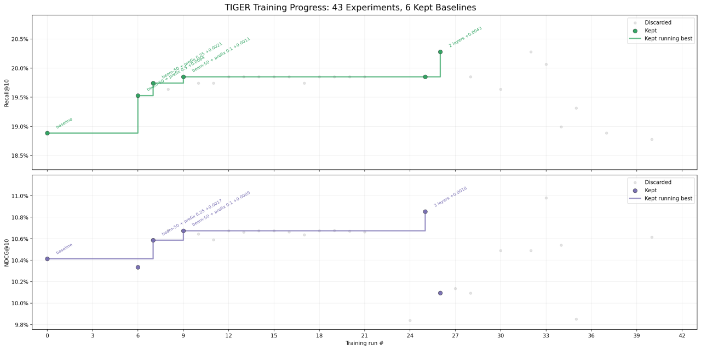

# auto-rec-sys

`auto-rec-sys` is an autonomous recommender-systems research workspace for
Nipponhomes semantic-ID recommendations. The current auto-research loop is
focused on the transformer/TIGER recommendation stage. RQ-VAE was also run
autonomously as the upstream semantic-ID assignment stage.

```text
prepared catalog/session data -> RQ-VAE semantic IDs -> TIGER transformer -> eval
```

The control plane is a Codex CLI research loop. Modal runs data preparation,
semantic-ID assignment, transformer training, evaluation, and artifact logging.

## Training Progress



The chart is a TIGER transformer-stage snapshot generated from:

```text
C:\Users\angel\Documents\projects\auto-tiger-ran\results.tsv
```

At the time of the chart, the TIGER loop had run 43 experiments and kept 6
baselines. The source ledger currently has 62 TIGER rows and 8 promoted
baselines. The best Recall@10 row is
`tiger-norm-input-drop015-l2-5m-20260526-001` with Recall@10 `0.2146` and
NDCG@10 `0.1164`; the best NDCG@10 row is
`tiger-norm-input-drop005-l2-5m-20260526-001` with Recall@10 `0.2092` and
NDCG@10 `0.1167`.

## Current Results

- `results_rqvae.tsv`: RQ-VAE semantic-ID ablations. The best kept upstream
  mapping is `structured_metadata` with codebook size 256 and 4 RQ levels:
  1,209,839 catalog items, 518,168 unique full codes, collision-free fraction
  `0.4283`, level-2 prefix spread `26,811`, and max level-2 prefix size
  `2,359`.
- `results_downstream.tsv`: local downstream next-item baselines using the
  generated semantic IDs. The strongest local row is
  `downstream-structured-v7-gru4rec_small-20260530T214233Z` with Recall@10
  `0.1572` and NDCG@10 `0.0956`.
- `C:\Users\angel\Documents\projects\auto-tiger-ran\results.tsv`: the active
  TIGER transformer auto-research ledger behind the progress chart.

## Files

- `program.md`: research contract, artifacts, metrics, and Modal role plan.
- `AGENTS.md`: local Codex instructions for this workspace.
- `orchestrator.md`: principal-investigator loop for Codex.
- `agents/*.md`: focused worker briefs for data, RQ-VAE, and transformer
  experiments.
- `prepare.py`: starting data-lab implementation for catalog/session snapshots
  and dataset transforms.
- `rqvae_ablation.py`: RQ-VAE experiment runner for semantic-ID ablations.
- `downstream_models.py`: local downstream model definitions for next-item
  baselines.
- `modal_app.py`: Modal workbench for data, RQ-VAE, downstream dataset, model,
  and evaluation runs.
- `pyproject.toml`: local Python dependencies for `uv`.
- `results.tsv`: original local append-only ledger/header.
- `results_rqvae.tsv`: RQ-VAE experiment ledger.
- `results_downstream.tsv`: downstream next-item experiment ledger.

This workspace contains the downstream implementation surface for RQ-VAE,
semantic-ID assignment, transformer dataset generation, and TIGER training
experiments.

## Setup

Run from this folder:

```powershell
uv sync
```

Provide DB credentials to Modal:

```powershell
modal setup
$env:DATABASE_URL="postgresql://..."
modal secret create nipponhomes-auto-rec-sys-db DATABASE_URL="$env:DATABASE_URL"
```

## Snapshot Data

Data work is Modal-native. The `Prepare` step pulls whole read-only source
tables as raw CSV snapshots:

- `listings`,
- `listing_views`.

It writes versioned raw CSV artifacts and table metadata. Later Modal functions
materialize vectors, RQ-VAE semantic IDs, next-item datasets, model checkpoints,
and evaluation reports:

```powershell
uv run modal run modal_app.py --campaign-id demo --dataset-id snapshot-001
```

Artifacts live on the Modal Volume under:

```text
/vol/auto-rec-sys/<campaign_id>/datasets/<dataset_id>/
```

Prefer a small Modal function that answers the next research question over
moving raw data local or adding an opaque remote code executor.

The current kept RQ-VAE path uses `structured_metadata` semantic IDs. The active
research loop then evaluates transformer-stage changes against those semantic
IDs and the shared next-item evaluation contract.

## Log Experiments

Modal artifacts remain the source of truth for datasets, checkpoints, metric
JSON, reports, and logs. Local TSV files mirror the concise experiment trail for
quick comparison.

## Start Codex

Start Codex CLI from the repo or this folder and give it the orchestrator:

```text
/goal Read orchestrator.md and continue the transformer-stage TIGER
auto-research cycle. Use Modal runs for experiments and append result rows.
```

The upstream data and RQ-VAE stages already have kept results. New work should
focus on the transformer/TIGER stage unless the transformer results expose a
specific upstream semantic-ID issue.

## Current Modal Roles

The current roles are:

1. `data`: DB snapshot, profiling, paired catalog/session cleaning.
2. `rqvae`: upstream RQ-VAE semantic-ID ablations and assignment artifacts.
3. `sft`: semantic-ID next-item dataset and shared eval materialization.
4. `llm_train`: active TIGER transformer training and checkpoint writes.
5. `checkpoint_app`: checkpoint inference and inspection webapp.

The run lineage is artifact-first. Experiments do not depend on git
commit/revert loops.
